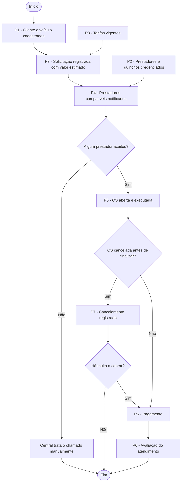
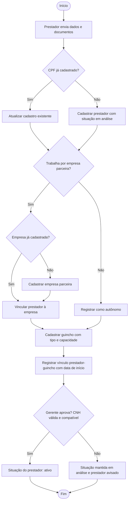
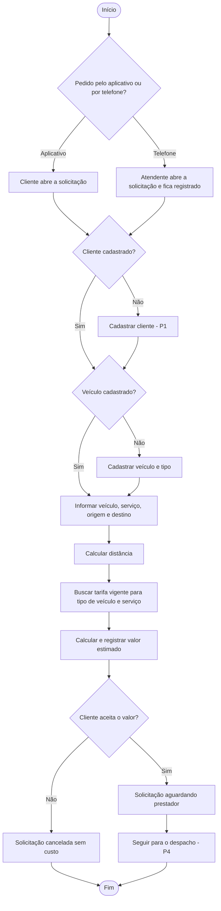
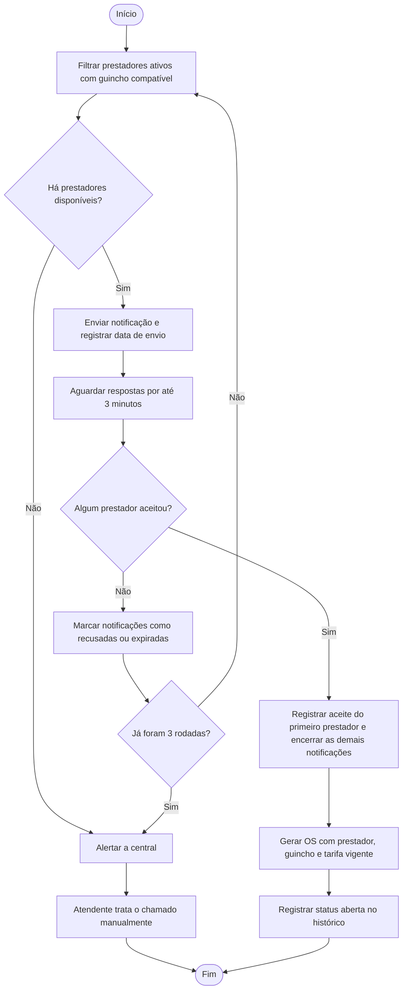
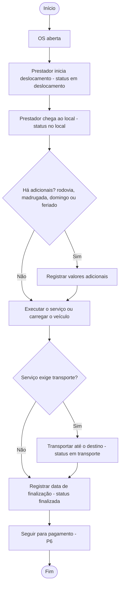
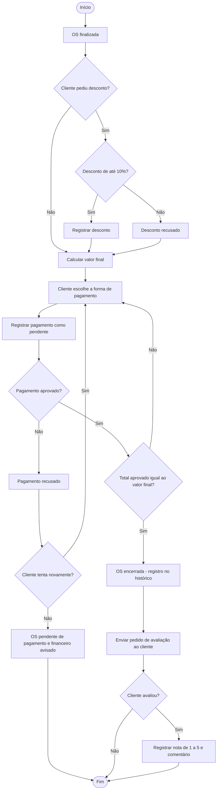
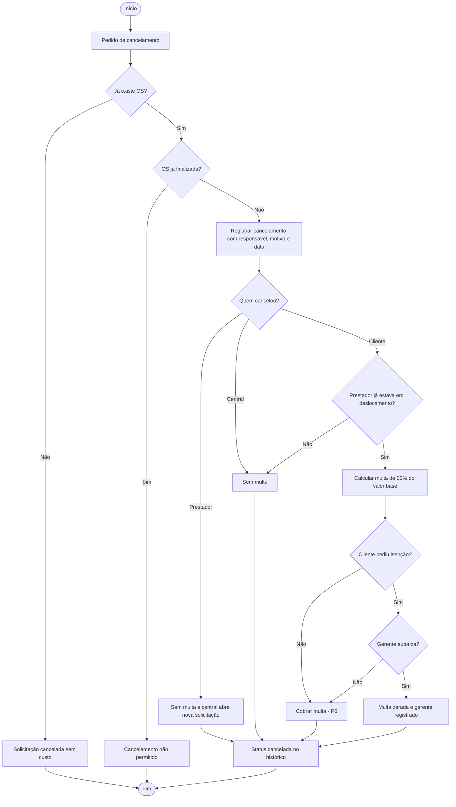
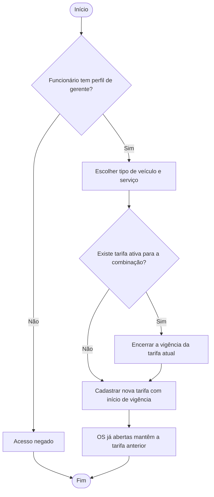

# Projeto ERP — Feliguinchos

Primeira entrega do Projeto Integrador de Modelagem de Dados.

*A Feliguinchos é uma empresa fictícia. Montamos o cenário com base em como funcionam as pequenas empresas de guincho e auto socorro da região.*

Arquivos do repositório:

```
README.md                    documentação da entrega
docs/der/der_conceitual.png  DER em imagem
docs/der/der_conceitual.svg  DER em vetor (dá para ampliar sem perder qualidade)
```

---

## 1. Identificação da equipe

| Integrante | RGM |
|---|---|
| Alexander Serafim | 049269569 |
| Anthony Gabriel Pereira Dos Santos | 49353411 |
| Arthur Kassab Dias | 47137621 |
| David Oliveira Dos Santos | 47235179 |
| Enzo Veríssimo | 47242493 |
| Evandro Araujo Costa | 47300761 |
| Felipe Dias Gomes | 48814342 |
| Felipe Gabriel Evangelista Alexandrias | 47251735 |
| Gabriel Da Silva | 47771526 |
| Guilherme Santos Peixoto Muniz | 46924507 |
| João Vitor Rocha Silva | 47170867 |
| Pablo Soares Gomes | 49150308 |

---

## 2. Caracterização da empresa

A Feliguinchos Reboque Automotivo Ltda. é uma microempresa de reboque e auto socorro 24 horas, com sede na Zona Leste de São Paulo. Ela atende a capital, a Grande São Paulo e trechos das rodovias Dutra e Ayrton Senna.

A empresa começou em 2018 com um único guincho próprio. Quando a procura aumentou, os sócios preferiram não comprar mais caminhões e passaram a trabalhar como uma central: recebem o pedido do cliente e chamam um guincheiro credenciado para fazer o serviço. O ganho vem da diferença entre o que o cliente paga e o que é repassado ao guincheiro. Hoje a rede tem 28 prestadores (18 autônomos e 10 ligados a quatro pequenas empresas parceiras), que somam 34 guinchos. A média é de uns 600 atendimentos por mês.

Os serviços oferecidos são reboque urbano, reboque em rodovia, reboque de moto, socorro mecânico leve, troca de pneu, carga de bateria e pane seca. Os clientes são, em sua maioria, motoristas particulares e motoboys. Uma parte menor, mas que volta sempre, são pequenas frotas: autoescolas, transportadoras pequenas e empresas de entrega.

A equipe interna tem cinco pessoas, divididas assim:

| Setor | O que faz |
|---|---|
| Atendimento (central 24h, 3 atendentes em turnos) | Recebe os pedidos por telefone e WhatsApp, anota os dados, passa o valor e acompanha o chamado |
| Operação / despacho | Chama o guincheiro e acompanha o atendimento até o fim (hoje é feito pelos próprios atendentes) |
| Credenciamento | Cadastra guincheiros, empresas parceiras e guinchos e confere os documentos |
| Financeiro (1 auxiliar) | Confere pagamentos e faz o fechamento do mês |
| Gerência (1 gerente, que também é sócio) | Define preços, aprova novos guincheiros e resolve cancelamentos e reclamações |

**Como funciona hoje.** O cliente liga ou manda mensagem no WhatsApp. O atendente anota o chamado numa planilha do Google, olha a tabela de preços impressa na parede e passa um valor aproximado. Depois joga o chamado no grupo de WhatsApp dos guincheiros, e quem responder primeiro fica com o serviço. O acompanhamento é todo por mensagem e ligação. O pagamento é por Pix na conta da empresa ou em dinheiro direto para o guincheiro, e só é conferido no fim do mês, cruzando extrato, planilha e conversa de WhatsApp. Os documentos dos guincheiros ficam numa pasta no escritório.

As informações que importam para o negócio são: clientes e seus veículos, guincheiros e os guinchos que eles usam, quais guinchos servem para quais veículos, a tabela de preços, os chamados e os atendimentos, o andamento de cada serviço, os cancelamentos, os pagamentos e a opinião dos clientes.

---

## 3. Justificativa da escolha

Escolhemos a Feliguinchos porque, mesmo sendo pequena, ela tem processos claros e bem separados. Todo atendimento passa pelas mesmas etapas: pedido, escolha do guincheiro, execução, pagamento e avaliação. Cada etapa gera informação que precisa ser guardada, o que dá material concreto para a análise.

O segundo motivo é a desorganização. Os dados de um mesmo atendimento ficam espalhados entre planilha, grupo de WhatsApp, tabela impressa, extrato do banco e pasta de papel, sem nenhum lugar que reúna tudo. Os setores também dependem uns dos outros sem compartilhar informação: o atendimento precisa saber quais guincheiros estão ativos, o despacho precisa saber se o guincho aguenta o veículo e o financeiro precisa saber o que foi atendido. Hoje cada um refaz o trabalho do outro.

Por isso a empresa é um bom caso para um ERP: um sistema único que junte cadastro, operação, financeiro e gestão na mesma base. Por fim, o negócio tem situações que exigem modelagem de verdade, como relacionamentos N:N com atributos próprios, preços que mudam com o tempo e regras de cancelamento, sem precisar inventar complexidade.

---

## 4. Problemas identificados

| Problema | Consequência | Requisitos relacionados |
|---|---|---|
| Chamados anotados na planilha e, às vezes, só no WhatsApp | Chamados se perdem e não existe histórico confiável | RF11, RF15 |
| Despacho feito no grupo de WhatsApp ("quem pega?") | Demora para achar guincheiro, às vezes dois vão ao mesmo chamado e não fica registrado quem recusou | RF13, RF14 |
| Preço calculado de cabeça, com uma tabela impressa desatualizada | Clientes pagam valores diferentes pelo mesmo serviço, o que gera reclamação | RF10, RF12 |
| O mesmo cliente aparece várias vezes na planilha, com telefones diferentes | Cadastro duplicado e dificuldade para achar o histórico do cliente | RF01, RF20 |
| A central não sabe ao certo qual guincho cada guincheiro está usando nem se ele comporta o veículo | Guincho errado enviado (guincho leve para uma van ou para um carro blindado, por exemplo) | RF04, RF07, RF08 |
| Documentos dos guincheiros guardados numa pasta, sem controle | Guincheiro com documentação vencida atendendo cliente | RF06 |
| Nenhuma regra clara para cancelamento | Prejuízo com deslocamento perdido e discussão com cliente e guincheiro | RF16 |
| Pix e dinheiro sem conferência na hora | Não se sabe quais atendimentos foram pagos e o fechamento nunca bate | RF17 |
| Nenhum registro da opinião do cliente | A gerência não consegue identificar quem atende mal | RF18 |
| Relatórios montados à mão no fim do mês | Horas de retrabalho e números pouco confiáveis | RF21 |
| Qualquer pessoa altera a planilha e não fica registrado quem mexeu | Erros sem responsável e dados alterados sem querer | RF19, RNF01, RNF03 |

---

## 5. Processos de negócio

| Código | Processo | Quem participa | O que inicia | O que acontece | Informação gerada | Resultado |
|---|---|---|---|---|---|---|
| P1 | Cadastro de cliente e veículo | Cliente, atendente | Primeiro contato do cliente | Registro dos dados, telefones, endereço e veículos | Cliente, Veículo | Cliente pode pedir atendimento |
| P2 | Credenciamento de prestador e guincho | Prestador, empresa parceira, atendente, gerente | Guincheiro quer entrar na rede | Cadastro do prestador, da empresa (se tiver) e dos guinchos, vínculo prestador–guincho e análise dos documentos | Prestador, Empresa, Veículo_Reboque, vínculo Opera | Prestador ativo e liberado para receber chamados |
| P3 | Solicitação de reboque | Cliente, atendente | Pedido pelo aplicativo ou por telefone | Escolha do veículo, do serviço e dos endereços, e cálculo do valor pela tarifa vigente | Solicitação | Solicitação aguardando prestador |
| P4 | Despacho | Sistema, prestadores, atendente | Solicitação aguardando prestador | Aviso aos prestadores compatíveis, registro das respostas e abertura da OS no primeiro aceite | Notificações, Ordem de Serviço | OS aberta com prestador, guincho e tarifa definidos |
| P5 | Execução do atendimento | Prestador, atendente | Abertura da OS | Deslocamento, chegada, serviço, transporte e entrega, com cada etapa registrada | Histórico de status, adicionais | OS finalizada |
| P6 | Pagamento e avaliação | Cliente, financeiro | OS finalizada | Cálculo do valor final, registro dos pagamentos e pedido de avaliação | Pagamento, Avaliação | OS encerrada |
| P7 | Cancelamento | Cliente, prestador, atendente, gerente | Pedido de cancelamento | Verificação do momento, cálculo da multa e, se for o caso, isenção pelo gerente | Cancelamento, histórico | OS cancelada |
| P8 | Manutenção de tarifas | Gerente | Reajuste ou serviço novo | Cadastro da nova tarifa com vigência e encerramento da anterior | Tarifa | Preços atualizados sem mexer nos atendimentos em andamento |

Os processos dependem uns dos outros. P2 e P8 são a base: sem prestador credenciado não tem despacho, e sem tarifa não tem como passar o valor. P3 alimenta P4, que abre a OS executada em P5, que termina em P6. O cancelamento (P7) pode interromper o ciclo durante P4 ou P5.

---

## 6. Requisitos funcionais

| Código | Requisito |
|---|---|
| RF01 | O sistema deverá cadastrar clientes, com seus telefones e endereço. |
| RF02 | O sistema deverá cadastrar os veículos de cada cliente. |
| RF03 | O sistema deverá manter o cadastro de tipos de veículo. |
| RF04 | O sistema deverá manter o cadastro de tipos de guincho e registrar com quais tipos de veículo cada um é compatível. |
| RF05 | O sistema deverá cadastrar as empresas parceiras. |
| RF06 | O sistema deverá credenciar prestadores e controlar sua situação (em análise, ativo, suspenso, inativo). |
| RF07 | O sistema deverá cadastrar os guinchos e seus tipos. |
| RF08 | O sistema deverá registrar quais guinchos cada prestador opera e em qual período. |
| RF09 | O sistema deverá manter o cadastro dos serviços oferecidos. |
| RF10 | O sistema deverá manter as tarifas por tipo de veículo e serviço, com período de vigência. |
| RF11 | O sistema deverá registrar solicitações feitas pelo aplicativo ou pela central. |
| RF12 | O sistema deverá calcular o valor estimado da solicitação com base na tarifa vigente e na distância. |
| RF13 | O sistema deverá avisar os prestadores compatíveis e registrar a resposta de cada um. |
| RF14 | O sistema deverá abrir a ordem de serviço quando um prestador aceitar a solicitação. |
| RF15 | O sistema deverá registrar cada mudança de status da ordem de serviço, com data e hora. |
| RF16 | O sistema deverá registrar cancelamentos com responsável, motivo e multa, quando houver. |
| RF17 | O sistema deverá registrar os pagamentos de cada ordem de serviço e a forma usada. |
| RF18 | O sistema deverá registrar a avaliação do cliente sobre o atendimento. |
| RF19 | O sistema deverá cadastrar os funcionários da central e seus perfis de acesso. |
| RF20 | O sistema deverá permitir consultar o histórico de atendimentos de um cliente. |
| RF21 | O sistema deverá gerar relatórios de atendimentos por período e por prestador, de faturamento e de média das avaliações. |

---

## 7. Requisitos não funcionais

| Código | Tipo | Requisito |
|---|---|---|
| RNF01 | Controle de acesso | O sistema deverá liberar as funções de acordo com o perfil do funcionário (atendente, financeiro ou gerente). |
| RNF02 | Segurança | As senhas de clientes e funcionários deverão ser guardadas criptografadas. |
| RNF03 | Auditoria | O sistema deverá registrar as mudanças de status das ordens de serviço, com data, hora e o funcionário responsável, quando houver. |
| RNF04 | Disponibilidade | O sistema deverá funcionar 24 horas por dia, 7 dias por semana, porque o atendimento não para. |
| RNF05 | Desempenho | O aviso aos prestadores deverá sair em até 10 segundos depois da confirmação da solicitação. |
| RNF06 | Tempo de resposta | As consultas de ordens de serviço e do histórico do cliente deverão responder em até 3 segundos. |
| RNF07 | Usabilidade | As telas usadas pelos prestadores deverão funcionar bem no celular, já que eles usam o sistema na rua. |
| RNF08 | Privacidade | O tratamento dos dados pessoais deverá seguir a LGPD (Lei nº 13.709/2018). |
| RNF09 | Confiabilidade | Deverá ser feito backup diário da base de dados. |
| RNF10 | Escalabilidade | Novos tipos de veículo, tipos de guincho, serviços e formas de pagamento deverão entrar por cadastro, sem mudar a estrutura do sistema. |

---

## 8. Regras de negócio

As regras foram numeradas para poderem ser citadas nas cardinalidades (seção 14) e nas justificativas (seção 17).

**Clientes e veículos**

| Código | Regra |
|---|---|
| RN01 | Um cliente pode ter nenhum ou vários veículos cadastrados. Cada veículo pertence a um único cliente. |
| RN02 | Todo cliente precisa informar pelo menos um telefone e pode informar vários. |
| RN03 | CPF e e-mail do cliente não podem se repetir. |
| RN04 | Todo veículo tem exatamente um tipo (carro de passeio, moto, utilitário, van, caminhonete). Um tipo pode classificar nenhum ou vários veículos. |
| RN05 | A placa do veículo não pode se repetir. |

**Prestadores e guinchos**

| Código | Regra |
|---|---|
| RN06 | O prestador pode ser autônomo ou estar ligado a uma única empresa parceira. Uma empresa pode ter nenhum ou vários prestadores. |
| RN07 | O CPF do prestador e o CNPJ da empresa parceira não podem se repetir. |
| RN08 | Todo guincho tem exatamente um tipo (plataforma, asa-delta, reboque leve, pesado). Um tipo pode classificar nenhum ou vários guinchos. |
| RN09 | Um prestador pode operar vários guinchos e um guincho pode ser operado por vários prestadores ao longo do tempo. Cada vínculo guarda data de início, data de fim e situação. |
| RN10 | Todo tipo de veículo precisa ser compatível com pelo menos um tipo de guincho. Um tipo de guincho pode atender nenhum ou vários tipos de veículo. |

**Serviços e tarifas**

| Código | Regra |
|---|---|
| RN11 | Uma tarifa vale para um tipo de veículo e um serviço. O mesmo tipo de veículo e o mesmo serviço podem ter várias tarifas ao longo do tempo. |
| RN12 | Não pode haver duas tarifas ativas no mesmo período para o mesmo tipo de veículo e o mesmo serviço. |

**Solicitação e despacho**

| Código | Regra |
|---|---|
| RN13 | Toda solicitação é de um único veículo. Um veículo pode ter nenhuma ou várias solicitações. |
| RN14 | Toda solicitação pede um único serviço. Um serviço pode aparecer em nenhuma ou várias solicitações. |
| RN15 | A solicitação pode ser aberta pelo cliente no aplicativo, sem funcionário envolvido, ou por um atendente da central. Um atendente pode abrir várias. |
| RN16 | O valor estimado é calculado com a tarifa vigente na hora do pedido e fica guardado como o valor que foi passado ao cliente. |
| RN17 | Uma solicitação pode ser enviada a vários prestadores, e um prestador pode receber várias solicitações. Cada envio guarda data de envio, data de resposta e situação (pendente, aceita, recusada, expirada). |
| RN18 | Só são avisados os prestadores ativos que estejam operando, naquele momento, um guincho compatível com o tipo do veículo. |
| RN19 | Uma solicitação gera no máximo uma ordem de serviço, no primeiro aceite. Toda ordem de serviço vem de uma única solicitação. |

**Ordem de serviço**

| Código | Regra |
|---|---|
| RN20 | Toda ordem de serviço é feita por um único prestador, com um único guincho. Um prestador e um guincho podem estar em nenhuma ou várias ordens de serviço. |
| RN21 | A ordem de serviço guarda a tarifa vigente no momento em que foi aberta. Um reajuste depois disso não muda as ordens já abertas. |
| RN22 | Toda mudança de status da ordem de serviço gera um registro no histórico. Por isso toda OS tem pelo menos um registro, o de abertura. |
| RN23 | Quando um funcionário muda o status, ele fica identificado no histórico. Quando a mudança vem do prestador ou do próprio sistema, não há funcionário ligado ao registro. |
| RN24 | O valor final da OS é o valor base mais os adicionais, menos o desconto. |

**Cancelamento, pagamento e avaliação**

| Código | Regra |
|---|---|
| RN25 | Uma ordem de serviço só pode ser cancelada uma vez, e só antes de ser finalizada. |
| RN26 | Só um funcionário com perfil de gerente pode liberar a isenção de multa de um cancelamento. Um gerente pode liberar várias. |
| RN27 | Uma ordem de serviço pode ter nenhuma ou várias tentativas de pagamento. Cada pagamento é de uma única OS. |
| RN28 | Todo pagamento usa uma única forma de pagamento. |
| RN29 | A OS só é encerrada quando a soma dos pagamentos aprovados é igual ao valor final. |
| RN30 | Uma ordem de serviço pode receber no máximo uma avaliação, só depois de finalizada, com nota de 1 a 5. |

---

## 9. Restrições e políticas organizacionais

São decisões da gerência que o sistema precisa respeitar.

| Política | Como aparece no modelo |
|---|---|
| Só o gerente cadastra e altera tarifas. | Perfil de acesso do funcionário (RNF01) |
| Só o gerente aprova o credenciamento de um prestador, e só com CNH válida e compatível com o guincho. | Situação do prestador só passa para "ativo" pelo perfil gerente |
| O desconto numa OS não pode passar de 10% do valor base somado aos adicionais. | Atributo desconto da OS |
| Cancelar antes de algum prestador aceitar não custa nada. Se o cliente cancelar depois que o prestador já saiu, paga multa de 20% do valor base. Se quem cancelar for o prestador ou a central, o cliente não paga multa. | Entidade Cancelamento (tipo_responsavel e valor_multa) e status da solicitação |
| A isenção de multa só pode ser dada pelo gerente. | Relacionamento AUTORIZA, entre Funcionário e Cancelamento |
| O aviso ao prestador expira em 3 minutos sem resposta. Depois de três rodadas sem aceite, a central é alertada e resolve o chamado manualmente. | Atributos do relacionamento NOTIFICA |
| Carro blindado só pode ser levado por guincho plataforma com capacidade para o peso. | Atributo blindado do veículo e compatibilidade entre tipos |
| Prestador com média abaixo de 3,0 nas últimas 20 OS fica suspenso até a gerência analisar. | Avaliação ligada à OS e situação do prestador |
| Se o prestador cancelar uma OS, a central abre uma nova solicitação para o cliente, com prioridade. | RN19 (uma OS por solicitação) e processo P7 |
| Ordens de serviço, pagamentos e cancelamentos não podem ser apagados, só ter o status alterado. | Histórico de status (RNF03) |
| Dados pessoais dos clientes só ficam visíveis para quem precisa deles no trabalho. | Perfil de acesso (RNF01) e LGPD (RNF08) |
| Formas aceitas: Pix, crédito, débito e dinheiro. O pagamento em dinheiro precisa ser confirmado pelo prestador no aplicativo. | Entidade Forma_Pagamento e status do pagamento |

---
## 10. Fluxogramas

Os fluxogramas mostram como os processos da seção 5 vão funcionar com o sistema. As decisões de cada fluxo seguem as regras da seção 8 e as políticas da seção 9.

### 10.1 Visão geral integrada

Mostra a ligação entre os processos. As linhas tracejadas são processos que fornecem dados para outros.



### 10.2 Credenciamento de prestador e guincho (P2)



### 10.3 Solicitação de reboque (P3)



### 10.4 Despacho do prestador (P4)



### 10.5 Execução do atendimento (P5)



Cada mudança de status neste fluxo gera um registro no histórico da OS (RN22).

### 10.6 Pagamento e avaliação (P6)



### 10.7 Cancelamento (P7)



### 10.8 Manutenção de tarifas (P8)



---
## 11. Entidades

Chegamos às entidades procurando os substantivos dos requisitos e das regras. Só ficou como entidade o que tem informação própria que a empresa precisa guardar.

| Entidade | O que representa | Por que existe | Origem |
|---|---|---|---|
| **Cliente** | Pessoa que solicita o atendimento | É a origem de toda solicitação e o dono dos veículos atendidos | RF01, RN01 |
| **Veiculo** | Veículo do cliente que será rebocado ou socorrido | O tipo e as características do veículo definem o guincho e a tarifa | RF02, RN01, RN04 |
| **Tipo_Veiculo** | Categoria do veículo (carro, moto, utilitário, van...) | Padroniza a classificação usada no preço e na compatibilidade, evitando digitações diferentes | RF03, RN04, RN10 |
| **Tipo_Guincho** | Categoria do guincho (plataforma, asa-delta, leve, pesado) | Define quais veículos cada guincho pode transportar | RF04, RN08, RN10 |
| **Empresa** | Pequena empresa parceira à qual alguns prestadores pertencem | Parte da rede é formada por empresas, e é preciso saber a quem o prestador está ligado | RF05, RN06 |
| **Prestador** | Guincheiro credenciado que executa os atendimentos | É quem recebe as notificações e executa as ordens de serviço | RF06, RN06 |
| **Veiculo_Reboque** | Guincho usado nos atendimentos | O guincho tem placa, capacidade e tipo próprios e pode passar por mais de um prestador | RF07, RN08, RN09 |
| **Servico_Reboque** | Serviço oferecido (reboque urbano, troca de pneu...) | O serviço define o preço e o tipo de atendimento | RF09, RN14 |
| **Tarifa** | Preço de um serviço para um tipo de veículo em um período | Os preços mudam com o tempo e dependem de duas informações ao mesmo tempo | RF10, RN11, RN12 |
| **Solicitacao** | Pedido de socorro feito pelo cliente | Guarda o chamado mesmo quando nenhum prestador aceita, que era o problema dos chamados perdidos | RF11, RN13 a RN16 |
| **Ordem_Servico** | Atendimento efetivo, criado quando um prestador aceita | Concentra quem atendeu, com qual guincho, por qual preço e com qual resultado | RF14, RN19 a RN21 |
| **Historico_Status** | Cada mudança de status de uma OS | Permite acompanhar o atendimento e saber quem alterou o quê e quando | RF15, RN22, RN23 |
| **Cancelamento** | Cancelamento de uma OS | Guarda responsável, motivo e multa, que não cabem na própria OS sem deixá-la cheia de campos vazios | RF16, RN25, RN26 |
| **Pagamento** | Cada tentativa de pagamento de uma OS | Uma OS pode ter mais de uma tentativa, e cada uma precisa ficar registrada | RF17, RN27 |
| **Forma_Pagamento** | Meio de pagamento (Pix, crédito, débito, dinheiro) | Padroniza os meios aceitos e permite incluir novos por cadastro | RN28 |
| **Avaliacao** | Opinião do cliente sobre o atendimento | Permite medir a qualidade dos prestadores | RF18, RN30 |
| **Funcionario** | Pessoa da central (atendente, financeiro, gerente) | Controla o acesso e identifica quem abriu chamados, alterou status e autorizou isenções | RF19, RNF01, RN15, RN23, RN26 |

Algumas coisas ficaram de fora como entidade. O *endereço* ficou como atributo composto do Cliente, porque não é compartilhado entre clientes nem existe sozinho. O *telefone* virou atributo multivalorado. O *status* ficou como atributo porque os valores são poucos e fixos. Já a notificação, o vínculo prestador–guincho e a compatibilidade viraram atributos de relacionamento (seção 14.3).

---

## 12. Atributos

**Legenda de classificação:** **(ID)** identificador · **(S)** simples · **(C)** composto · **(M)** multivalorado · **(D)** derivado. A descrição completa de cada atributo está no dicionário de dados (seção 15).

| Entidade | Atributos |
|---|---|
| Cliente | id_cliente (ID), nome (S), cpf (S), email (S), senha (S), telefone (M), endereco (C: logradouro, numero, complemento, bairro, cidade, uf, cep), data_cadastro (S), status (S) |
| Veiculo | id_veiculo (ID), placa (S), marca (S), modelo (S), ano (S), cor (S), blindado (S) |
| Tipo_Veiculo | id_tipo_veiculo (ID), descricao (S), categoria (S) |
| Tipo_Guincho | id_tipo_guincho (ID), descricao (S), capacidade_max_kg (S) |
| Empresa | id_empresa (ID), razao_social (S), cnpj (S), telefone (S), email (S) |
| Prestador | id_prestador (ID), nome (S), cpf (S), cnh (S), telefone (S), email (S), data_cadastro (S), status (S) |
| Veiculo_Reboque | id_veiculo_reboque (ID), placa (S), marca (S), modelo (S), ano (S), capacidade_kg (S), status (S) |
| Servico_Reboque | id_servico_reboque (ID), descricao (S), tipo_servico (S), status (S) |
| Tarifa | id_tarifa (ID), valor_base (S), valor_km (S), adicional_madrugada (S), adicional_domingo (S), adicional_feriado (S), adicional_rodovia (S), vigencia_inicio (S), vigencia_fim (S), status (S) |
| Solicitacao | id_solicitacao (ID), data_solicitacao (S), endereco_origem (S), endereco_destino (S), distancia_km (S), observacoes (S), valor_estimado (S), status (S) |
| Ordem_Servico | id_os (ID), data_inicio (S), data_previsao (S), data_finalizacao (S), status_os (S), observacoes (S), valor_base (S), valor_adicionais (S), desconto (S), valor_final (D) |
| Historico_Status | id_historico (ID), status (S), data_hora (S), observacao (S) |
| Cancelamento | id_cancelamento (ID), tipo_responsavel (S), motivo (S), data_hora (S), valor_multa (S) |
| Pagamento | id_pagamento (ID), valor (S), data_pagamento (S), status (S), comprovante (S) |
| Forma_Pagamento | id_forma_pagamento (ID), descricao (S), tipo (S) |
| Avaliacao | id_avaliacao (ID), nota (S), comentario (S), data_avaliacao (S) |
| Funcionario | id_funcionario (ID), nome (S), cpf (S), email (S), cargo (S), perfil_acesso (S), senha (S), status (S) |

**Atributos de relacionamento**

| Relacionamento | Atributos |
|---|---|
| Compativel (Tipo_Veiculo × Tipo_Guincho) | observacao (S) |
| Opera (Prestador × Veiculo_Reboque) | data_inicio (S), data_fim (S), status (S) |
| Notifica (Solicitacao × Prestador) | data_envio (S), data_resposta (S), status (S) |

---

## 13. Relacionamentos

Os relacionamentos saíram dos verbos das regras de negócio.

| Nº | Relacionamento | Entidades | Significado | Regra |
|---|---|---|---|---|
| 1 | POSSUI | Cliente e Veiculo | O cliente possui veículos cadastrados | RN01 |
| 2 | CLASSIFICADO | Veiculo e Tipo_Veiculo | O veículo é classificado por um tipo | RN04 |
| 3 | COMPATIVEL | Tipo_Veiculo e Tipo_Guincho | Um tipo de guincho pode transportar um tipo de veículo | RN10 |
| 4 | REFERE-SE | Veiculo e Solicitacao | A solicitação se refere a um veículo | RN13 |
| 5 | TIPO_DE | Solicitacao e Servico_Reboque | A solicitação pede um serviço | RN14 |
| 6 | ABRE | Funcionario e Solicitacao | O atendente abre a solicitação pela central | RN15 |
| 7 | DEFINE | Tipo_Veiculo e Tarifa | A tarifa é definida para um tipo de veículo | RN11 |
| 8 | PRECIFICA | Servico_Reboque e Tarifa | A tarifa dá o preço de um serviço | RN11 |
| 9 | VINCULA | Empresa e Prestador | O prestador pode estar vinculado a uma empresa parceira | RN06 |
| 10 | CLASSIFICA | Tipo_Guincho e Veiculo_Reboque | O guincho é classificado por um tipo | RN08 |
| 11 | OPERA | Prestador e Veiculo_Reboque | O prestador opera guinchos em determinados períodos | RN09 |
| 12 | NOTIFICA | Solicitacao e Prestador | A solicitação é enviada aos prestadores | RN17, RN18 |
| 13 | GERA | Solicitacao e Ordem_Servico | A solicitação aceita gera a OS | RN19 |
| 14 | APLICA | Tarifa e Ordem_Servico | A OS aplica a tarifa vigente | RN21 |
| 15 | EXECUTA | Prestador e Ordem_Servico | O prestador executa a OS | RN20 |
| 16 | UTILIZA | Veiculo_Reboque e Ordem_Servico | A OS utiliza um guincho | RN20 |
| 17 | REGISTRA | Ordem_Servico e Historico_Status | A OS registra suas mudanças de status | RN22 |
| 18 | ALTERA | Funcionario e Historico_Status | O funcionário altera o status da OS | RN23 |
| 19 | CANCELADA | Ordem_Servico e Cancelamento | A OS pode ser cancelada | RN25 |
| 20 | AUTORIZA | Funcionario e Cancelamento | O gerente autoriza a isenção de multa | RN26 |
| 21 | PAGA | Ordem_Servico e Pagamento | A OS é paga por um ou mais pagamentos | RN27 |
| 22 | PAGO_COM | Forma_Pagamento e Pagamento | O pagamento usa uma forma de pagamento | RN28 |
| 23 | AVALIADA | Ordem_Servico e Avaliacao | A OS recebe a avaliação do cliente | RN30 |

---

## 14. Cardinalidades

Analisamos cada relacionamento nos dois sentidos, pelo método "vá e volte".

Uma observação sobre a leitura do DER: usamos a notação de Chen com cardinalidade (mínima, máxima), no padrão do brModelo. Nesse padrão, a cardinalidade que fica junto de uma entidade diz quantas ocorrências dela podem se ligar a uma ocorrência do outro lado. Por exemplo, o (1,1) junto de Cliente, em POSSUI, quer dizer que cada veículo tem exatamente um cliente. Para não ficar dúvida, a tabela abaixo escreve a ida e a volta por extenso.

### 14.1 Tabela de cardinalidades

| Nº | Relacionamento | Ida | Volta | Tipo | Regra |
|---|---|---|---|---|---|
| 1 | Cliente POSSUI Veiculo | Um cliente possui quantos veículos? **(0,N)** | Um veículo pertence a quantos clientes? **(1,1)** | 1:N | RN01 |
| 2 | Veiculo CLASSIFICADO Tipo_Veiculo | Um veículo tem quantos tipos? **(1,1)** | Um tipo classifica quantos veículos? **(0,N)** | N:1 | RN04 |
| 3 | Tipo_Veiculo COMPATIVEL Tipo_Guincho | Um tipo de veículo é compatível com quantos tipos de guincho? **(1,N)** | Um tipo de guincho atende quantos tipos de veículo? **(0,N)** | N:N | RN10 |
| 4 | Veiculo REFERE-SE Solicitacao | Um veículo tem quantas solicitações? **(0,N)** | Uma solicitação se refere a quantos veículos? **(1,1)** | 1:N | RN13 |
| 5 | Solicitacao TIPO_DE Servico_Reboque | Uma solicitação pede quantos serviços? **(1,1)** | Um serviço aparece em quantas solicitações? **(0,N)** | N:1 | RN14 |
| 6 | Funcionario ABRE Solicitacao | Um funcionário abre quantas solicitações? **(0,N)** | Uma solicitação é aberta por quantos funcionários? **(0,1)** | 1:N | RN15 |
| 7 | Tipo_Veiculo DEFINE Tarifa | Um tipo de veículo tem quantas tarifas? **(0,N)** | Uma tarifa vale para quantos tipos de veículo? **(1,1)** | 1:N | RN11 |
| 8 | Servico_Reboque PRECIFICA Tarifa | Um serviço tem quantas tarifas? **(0,N)** | Uma tarifa vale para quantos serviços? **(1,1)** | 1:N | RN11 |
| 9 | Empresa VINCULA Prestador | Uma empresa tem quantos prestadores? **(0,N)** | Um prestador pertence a quantas empresas? **(0,1)** | 1:N | RN06 |
| 10 | Tipo_Guincho CLASSIFICA Veiculo_Reboque | Um tipo classifica quantos guinchos? **(0,N)** | Um guincho tem quantos tipos? **(1,1)** | 1:N | RN08 |
| 11 | Prestador OPERA Veiculo_Reboque | Um prestador opera quantos guinchos? **(0,N)** | Um guincho é operado por quantos prestadores? **(0,N)** | N:N | RN09 |
| 12 | Solicitacao NOTIFICA Prestador | Uma solicitação é enviada a quantos prestadores? **(0,N)** | Um prestador recebe quantas solicitações? **(0,N)** | N:N | RN17 |
| 13 | Solicitacao GERA Ordem_Servico | Uma solicitação gera quantas OS? **(0,1)** | Uma OS vem de quantas solicitações? **(1,1)** | 1:1 | RN19 |
| 14 | Tarifa APLICA Ordem_Servico | Uma tarifa é aplicada em quantas OS? **(0,N)** | Uma OS aplica quantas tarifas? **(1,1)** | 1:N | RN21 |
| 15 | Prestador EXECUTA Ordem_Servico | Um prestador executa quantas OS? **(0,N)** | Uma OS é executada por quantos prestadores? **(1,1)** | 1:N | RN20 |
| 16 | Veiculo_Reboque UTILIZA Ordem_Servico | Um guincho é usado em quantas OS? **(0,N)** | Uma OS usa quantos guinchos? **(1,1)** | 1:N | RN20 |
| 17 | Ordem_Servico REGISTRA Historico_Status | Uma OS tem quantos registros de status? **(1,N)** | Um registro pertence a quantas OS? **(1,1)** | 1:N | RN22 |
| 18 | Funcionario ALTERA Historico_Status | Um funcionário faz quantos registros? **(0,N)** | Um registro é feito por quantos funcionários? **(0,1)** | 1:N | RN23 |
| 19 | Ordem_Servico CANCELADA Cancelamento | Uma OS tem quantos cancelamentos? **(0,1)** | Um cancelamento se refere a quantas OS? **(1,1)** | 1:1 | RN25 |
| 20 | Funcionario AUTORIZA Cancelamento | Um gerente autoriza quantas isenções? **(0,N)** | Um cancelamento tem quantos autorizadores? **(0,1)** | 1:N | RN26 |
| 21 | Ordem_Servico PAGA Pagamento | Uma OS tem quantos pagamentos? **(0,N)** | Um pagamento pertence a quantas OS? **(1,1)** | 1:N | RN27 |
| 22 | Forma_Pagamento PAGO_COM Pagamento | Uma forma é usada em quantos pagamentos? **(0,N)** | Um pagamento usa quantas formas? **(1,1)** | 1:N | RN28 |
| 23 | Ordem_Servico AVALIADA Avaliacao | Uma OS recebe quantas avaliações? **(0,1)** | Uma avaliação se refere a quantas OS? **(1,1)** | 1:1 | RN30 |

### 14.2 Verificação dos relacionamentos N:N

Fizemos a pergunta do manual para os pares em que os dois lados podiam ser "vários".

| Par | A pode ter vários B? | B pode ter vários A? | Conclusão |
|---|---|---|---|
| Tipo_Veiculo × Tipo_Guincho | Sim. Um carro de passeio pode ir em plataforma ou asa-delta | Sim. A plataforma leva carro, van e moto | **N:N** (COMPATIVEL) |
| Prestador × Veiculo_Reboque | Sim. O prestador pode trocar de guincho ou usar mais de um | Sim. Um guincho de empresa parceira passa por vários motoristas | **N:N** (OPERA) |
| Solicitacao × Prestador | Sim. O chamado é enviado a vários prestadores | Sim. O prestador recebe vários chamados ao longo do dia | **N:N** (NOTIFICA) |
| Cliente × Prestador | Sim | Sim | **Não modelado diretamente.** A ligação já existe pelo caminho Cliente → Veículo → Solicitação → OS → Prestador. Um relacionamento direto seria redundante. |
| Ordem_Servico × Forma_Pagamento | Sim, com pagamentos em formas diferentes | Sim | **Resolvido pela entidade Pagamento**, que tem identidade e atributos próprios (valor, data, comprovante) |

### 14.3 Atributos dos relacionamentos

| Relacionamento | Atributos | Por que pertencem ao relacionamento |
|---|---|---|
| COMPATIVEL | observacao | A observação ("somente com cinta de roda", por exemplo) descreve a combinação dos dois tipos, e não cada tipo isoladamente. |
| OPERA | data_inicio, data_fim, status | O período não é do prestador nem do guincho, e sim do vínculo entre eles. O mesmo prestador pode operar o mesmo guincho em períodos diferentes. |
| NOTIFICA | data_envio, data_resposta, status | Cada prestador responde de um jeito à mesma solicitação: um aceita, outro recusa, outro deixa expirar. A resposta só existe para o par solicitação–prestador. |

---
## 15. Dicionário de dados conceitual

Dicionário preliminar, no nível conceitual. Tipos de dados e tamanho dos campos ficam para o modelo lógico e o físico, nas próximas entregas.

**Classificação:** ID = identificador · S = simples · C = composto · M = multivalorado · D = derivado.

### Cliente
Pessoa que solicita atendimento à Feliguinchos.

| Atributo | Descrição | Classif. | Obrigatório | Regra / Observação |
|---|---|---|---|---|
| id_cliente | Identificador do cliente | ID | Sim | Único, gerado pelo sistema |
| nome | Nome completo | S | Sim | - |
| cpf | CPF do cliente | S | Sim | Não pode se repetir (RN03) |
| email | E-mail de contato e acesso ao aplicativo | S | Sim | Não pode se repetir (RN03) |
| senha | Senha de acesso ao aplicativo | S | Sim | Armazenada criptografada (RNF02) |
| telefone | Telefones de contato | M | Sim | Pelo menos um; pode haver vários (RN02) |
| endereco | Endereço residencial | C | Sim | Composto por logradouro, numero, complemento (opcional), bairro, cidade, uf e cep |
| data_cadastro | Data em que o cliente foi cadastrado | S | Sim | Preenchida pelo sistema |
| status | Situação do cadastro | S | Sim | Valores: ativo, inativo, bloqueado |

### Veiculo
Veículo do cliente atendido pelo serviço.

| Atributo | Descrição | Classif. | Obrigatório | Regra / Observação |
|---|---|---|---|---|
| id_veiculo | Identificador do veículo | ID | Sim | Único |
| placa | Placa do veículo | S | Sim | Não pode se repetir (RN05) |
| marca | Fabricante | S | Sim | - |
| modelo | Modelo | S | Sim | - |
| ano | Ano de fabricação | S | Sim | - |
| cor | Cor predominante | S | Sim | Ajuda o prestador a identificar o veículo no local |
| blindado | Indica se o veículo é blindado | S | Sim | Sim ou não. Carro blindado só pode ir em guincho plataforma com capacidade para o peso (seção 9) |

### Tipo_Veiculo
Categoria usada para definir preço e compatibilidade com guinchos.

| Atributo | Descrição | Classif. | Obrigatório | Regra / Observação |
|---|---|---|---|---|
| id_tipo_veiculo | Identificador do tipo | ID | Sim | Único |
| descricao | Nome do tipo (ex.: carro de passeio, moto, van) | S | Sim | Não pode se repetir |
| categoria | Agrupamento por porte | S | Sim | Valores: leve, médio, pesado |

### Tipo_Guincho
Categoria do guincho.

| Atributo | Descrição | Classif. | Obrigatório | Regra / Observação |
|---|---|---|---|---|
| id_tipo_guincho | Identificador do tipo | ID | Sim | Único |
| descricao | Nome do tipo (ex.: plataforma, asa-delta, reboque leve) | S | Sim | Não pode se repetir |
| capacidade_max_kg | Peso máximo suportado por esse tipo | S | Sim | Maior que zero |

### Empresa
Pequena empresa parceira à qual prestadores podem estar vinculados.

| Atributo | Descrição | Classif. | Obrigatório | Regra / Observação |
|---|---|---|---|---|
| id_empresa | Identificador da empresa | ID | Sim | Único |
| razao_social | Razão social | S | Sim | - |
| cnpj | CNPJ | S | Sim | Não pode se repetir (RN07) |
| telefone | Telefone comercial | S | Sim | - |
| email | E-mail comercial | S | Não | - |

### Prestador
Guincheiro credenciado que executa os atendimentos.

| Atributo | Descrição | Classif. | Obrigatório | Regra / Observação |
|---|---|---|---|---|
| id_prestador | Identificador do prestador | ID | Sim | Único |
| nome | Nome completo | S | Sim | - |
| cpf | CPF | S | Sim | Não pode se repetir (RN07) |
| cnh | Número da CNH | S | Sim | Precisa estar válida e ser compatível com o guincho (seção 9) |
| telefone | Telefone para contato em campo | S | Sim | - |
| email | E-mail | S | Sim | - |
| data_cadastro | Data do credenciamento | S | Sim | Preenchida pelo sistema |
| status | Situação do prestador | S | Sim | Valores: em análise, ativo, suspenso, inativo. Só o gerente ativa |

### Veiculo_Reboque
Guincho utilizado nos atendimentos.

| Atributo | Descrição | Classif. | Obrigatório | Regra / Observação |
|---|---|---|---|---|
| id_veiculo_reboque | Identificador do guincho | ID | Sim | Único |
| placa | Placa do guincho | S | Sim | Não pode se repetir |
| marca | Fabricante | S | Sim | - |
| modelo | Modelo | S | Sim | - |
| ano | Ano de fabricação | S | Sim | - |
| capacidade_kg | Capacidade real deste guincho | S | Sim | Não pode ser maior que a capacidade máxima do seu tipo |
| status | Situação do guincho | S | Sim | Valores: disponível, em manutenção, inativo |

### Servico_Reboque
Serviço oferecido pela empresa.

| Atributo | Descrição | Classif. | Obrigatório | Regra / Observação |
|---|---|---|---|---|
| id_servico_reboque | Identificador do serviço | ID | Sim | Único |
| descricao | Nome do serviço (ex.: reboque urbano, reboque em rodovia) | S | Sim | - |
| tipo_servico | Natureza do serviço | S | Sim | Valores: reboque, socorro mecânico, troca de pneu, carga de bateria, pane seca |
| status | Situação do serviço | S | Sim | Valores: ativo, inativo. Serviço inativo não aparece em novas solicitações |

### Tarifa
Preço de um serviço para um tipo de veículo durante um período.

| Atributo | Descrição | Classif. | Obrigatório | Regra / Observação |
|---|---|---|---|---|
| id_tarifa | Identificador da tarifa | ID | Sim | Único |
| valor_base | Valor fixo de saída | S | Sim | Maior que zero |
| valor_km | Valor cobrado por quilômetro | S | Sim | Maior ou igual a zero |
| adicional_madrugada | Percentual para atendimentos das 22h às 6h | S | Não | - |
| adicional_domingo | Percentual para atendimentos aos domingos | S | Não | - |
| adicional_feriado | Percentual para atendimentos em feriados | S | Não | - |
| adicional_rodovia | Percentual para atendimentos em rodovia | S | Não | - |
| vigencia_inicio | Data a partir da qual a tarifa vale | S | Sim | - |
| vigencia_fim | Data em que a tarifa deixa de valer | S | Não | Vazia enquanto a tarifa estiver em vigor. Não pode haver sobreposição (RN12) |
| status | Situação da tarifa | S | Sim | Valores: ativa, encerrada. Só o gerente altera |

### Solicitacao
Pedido de socorro feito pelo cliente.

| Atributo | Descrição | Classif. | Obrigatório | Regra / Observação |
|---|---|---|---|---|
| id_solicitacao | Identificador da solicitação | ID | Sim | Único |
| data_solicitacao | Data e hora do pedido | S | Sim | Preenchida pelo sistema |
| endereco_origem | Local onde o veículo está | S | Sim | Texto livre, pois pode ser um ponto de referência (ex.: "km 32 da Dutra, sentido RJ") |
| endereco_destino | Local para onde o veículo será levado | S | Não | Vazio em serviços sem transporte (troca de pneu, bateria) |
| distancia_km | Distância entre origem e destino | S | Não | Usada no cálculo do valor estimado |
| observacoes | Informações extras do cliente | S | Não | - |
| valor_estimado | Valor informado ao cliente antes do aceite | S | Sim | Calculado com a tarifa vigente e guardado como registro do que foi informado (RN16) |
| status | Situação da solicitação | S | Sim | Valores: aguardando prestador, atendida, sem prestador, cancelada |

### Ordem_Servico
Atendimento efetivo, criado no aceite do prestador.

| Atributo | Descrição | Classif. | Obrigatório | Regra / Observação |
|---|---|---|---|---|
| id_os | Identificador da OS | ID | Sim | Único |
| data_inicio | Data e hora da abertura da OS | S | Sim | Preenchida pelo sistema |
| data_previsao | Previsão de chegada ao local | S | Sim | Informada pelo prestador no aceite |
| data_finalizacao | Data e hora de conclusão | S | Não | Preenchida ao finalizar |
| status_os | Status atual da OS | S | Sim | Valores: aberta, em deslocamento, no local, em transporte, finalizada, encerrada, cancelada. Cada mudança gera histórico (RN22) |
| observacoes | Anotações do atendimento | S | Não | - |
| valor_base | Valor calculado pela tarifa aplicada | S | Sim | Valor base da tarifa mais o valor por km multiplicado pela distância |
| valor_adicionais | Soma dos adicionais aplicados | S | Não | Madrugada, domingo, feriado e rodovia |
| desconto | Desconto concedido | S | Não | No máximo 10% de valor_base + valor_adicionais (seção 9) |
| valor_final | Valor total a pagar | D | - | valor_base + valor_adicionais − desconto (RN24). Calculado, não armazenado |

### Historico_Status
Registro de cada mudança de status de uma OS.

| Atributo | Descrição | Classif. | Obrigatório | Regra / Observação |
|---|---|---|---|---|
| id_historico | Identificador do registro | ID | Sim | Único |
| status | Status assumido pela OS | S | Sim | Mesmos valores de status_os |
| data_hora | Momento da mudança | S | Sim | Preenchida pelo sistema |
| observacao | Comentário sobre a mudança | S | Não | - |

### Cancelamento
Cancelamento de uma OS.

| Atributo | Descrição | Classif. | Obrigatório | Regra / Observação |
|---|---|---|---|---|
| id_cancelamento | Identificador do cancelamento | ID | Sim | Único |
| tipo_responsavel | Quem pediu o cancelamento | S | Sim | Valores: cliente, prestador, central |
| motivo | Motivo informado | S | Sim | - |
| data_hora | Momento do cancelamento | S | Sim | - |
| valor_multa | Multa cobrada | S | Sim | 20% do valor base quando o cliente cancela após o início do deslocamento. Zero nos outros casos ou quando o gerente libera a isenção (seção 9) |

### Pagamento
Cada tentativa de pagamento de uma OS.

| Atributo | Descrição | Classif. | Obrigatório | Regra / Observação |
|---|---|---|---|---|
| id_pagamento | Identificador do pagamento | ID | Sim | Único |
| valor | Valor pago nesta tentativa | S | Sim | Maior que zero |
| data_pagamento | Data e hora do pagamento | S | Sim | - |
| status | Situação do pagamento | S | Sim | Valores: pendente, aprovado, recusado, estornado |
| comprovante | Referência do comprovante (código Pix, autorização do cartão) | S | Não | Obrigatório quando aprovado, exceto em dinheiro |

### Forma_Pagamento
Meio de pagamento aceito.

| Atributo | Descrição | Classif. | Obrigatório | Regra / Observação |
|---|---|---|---|---|
| id_forma_pagamento | Identificador da forma | ID | Sim | Único |
| descricao | Nome da forma (ex.: Pix, cartão de crédito) | S | Sim | Não pode se repetir |
| tipo | Tipo de liquidação | S | Sim | Valores: eletrônico, presencial |

### Avaliacao
Avaliação do cliente sobre o atendimento.

| Atributo | Descrição | Classif. | Obrigatório | Regra / Observação |
|---|---|---|---|---|
| id_avaliacao | Identificador da avaliação | ID | Sim | Único |
| nota | Nota dada pelo cliente | S | Sim | De 1 a 5 (RN30) |
| comentario | Comentário livre | S | Não | - |
| data_avaliacao | Data da avaliação | S | Sim | Só depois da finalização da OS |

### Funcionario
Pessoa que trabalha na central da Feliguinchos.

| Atributo | Descrição | Classif. | Obrigatório | Regra / Observação |
|---|---|---|---|---|
| id_funcionario | Identificador do funcionário | ID | Sim | Único |
| nome | Nome completo | S | Sim | - |
| cpf | CPF | S | Sim | Não pode se repetir |
| email | E-mail usado para acesso ao sistema | S | Sim | Não pode se repetir |
| cargo | Cargo na empresa | S | Sim | Ex.: atendente, auxiliar financeiro, gerente operacional |
| perfil_acesso | Perfil que define o que pode ser feito no sistema | S | Sim | Valores: atendente, financeiro, gerente (RNF01) |
| senha | Senha de acesso | S | Sim | Armazenada criptografada (RNF02) |
| status | Situação do funcionário | S | Sim | Valores: ativo, inativo |

### Atributos dos relacionamentos

| Relacionamento | Atributo | Descrição | Obrigatório | Regra / Observação |
|---|---|---|---|---|
| COMPATIVEL | observacao | Condição especial da compatibilidade | Não | Ex.: "somente com cinta de roda" |
| OPERA | data_inicio | Início do vínculo do prestador com o guincho | Sim | - |
| OPERA | data_fim | Fim do vínculo | Não | Vazio enquanto o vínculo estiver ativo |
| OPERA | status | Situação do vínculo | Sim | Valores: ativo, encerrado |
| NOTIFICA | data_envio | Momento em que o prestador foi notificado | Sim | - |
| NOTIFICA | data_resposta | Momento da resposta | Não | Vazio se a notificação expirar |
| NOTIFICA | status | Resultado da notificação | Sim | Valores: pendente, aceita, recusada, expirada. Expira em 3 minutos sem resposta |

---

## 16. DER

DER conceitual em notação de Chen, com cardinalidade (mínima, máxima). São 17 entidades e 23 relacionamentos, sendo 3 deles com atributos próprios.


Versão em vetor, para ampliar: [docs/der/der_conceitual.svg](docs/der/der_conceitual.svg)

**Legenda:** retângulo = entidade · losango = relacionamento · ● = atributo identificador · ○ = atributo · (1,n) no nome = multivalorado · atributo com ramificações = composto (endereco) · círculo tracejado = derivado (valor_final).

---
## 17. Justificativas técnicas

**1. Solicitação e Ordem de Serviço separadas**

Separamos o pedido do cliente (Solicitação) do atendimento de fato (Ordem de Serviço), e uma solicitação gera no máximo uma OS (RN19). Muitos pedidos nunca viram atendimento: o cliente desiste quando ouve o valor, ou nenhum guincheiro aceita. Se fosse tudo uma entidade só, prestador, guincho, tarifa e datas ficariam vazios nesses casos. Com a separação, a empresa também consegue ver quantos chamados perdeu, o que hoje é impossível porque muitos nem chegam na planilha.

**2. NOTIFICA como N:N com atributos**

O chamado vai para vários prestadores ao mesmo tempo, e cada um responde de um jeito: um aceita, outro recusa, outro nem vê. Essa resposta não pertence só à solicitação nem só ao prestador, e sim ao par. Por isso data_envio, data_resposta e status ficaram no relacionamento (RN17, RN18). Assim dá para saber quem recusou e quanto tempo cada um levou para responder, coisa que se perde hoje no grupo de WhatsApp.

**3. OPERA como N:N com período**

Nas empresas parceiras o mesmo guincho passa por motoristas diferentes, e um autônomo pode trocar de guincho. Se guardássemos só "o guincho do prestador", não saberíamos qual guincho ele usava num atendimento antigo nem teríamos certeza de quem pode receber um chamado agora. Com data_inicio, data_fim e status no vínculo, os dois casos ficam resolvidos (RN09, RN18).

**4. Compatibilidade entre tipos, e não entre guinchos e veículos**

Toda plataforma leva carro de passeio. Por isso a compatibilidade é uma característica do tipo, e não de cada guincho ou de cada carro. Registrar guincho por guincho multiplicaria os dados e abriria espaço para erro. Do jeito que ficou, basta informar o tipo quando um guincho novo é cadastrado (RN10, RNF10).

**5. Tarifa como entidade, com vigência**

O preço depende de duas coisas ao mesmo tempo, o tipo de veículo e o serviço, então não cabia como atributo de nenhum dos dois. E como o preço muda, a vigência deixa reajustar sem apagar a tarifa antiga. A OS guarda a tarifa que foi aplicada, e por isso um reajuste no meio do dia não altera os atendimentos em andamento (RN11, RN12, RN21).

**6. Histórico_Status além do status atual**

O status_os mostra como a OS está agora. Mas a gerência também precisa saber a que horas o prestador saiu, quando chegou e quem mudou cada etapa. É isso que atende a auditoria do RNF03 e resolve a questão de ninguém saber quem mexeu na planilha. A cardinalidade (1,N) garante que toda OS tenha pelo menos o registro de abertura (RN22, RN23).

**7. Pagamento (0,N) em relação à OS**

É zero no mínimo porque a OS existe antes de ser paga. É N porque um cartão pode ser recusado e o cliente tenta de novo, ou porque ele pode pagar uma parte no Pix e o resto em dinheiro. Cada tentativa precisa ficar registrada para o fechamento bater (RN27, RN29).

**8. Cancelamento como entidade própria, (0,1)**

A maioria das OS nunca é cancelada. Se responsável, motivo e multa ficassem dentro da OS, esses campos ficariam vazios quase sempre. Quando o cancelamento acontece antes de existir OS, ou seja, antes de algum prestador aceitar, não há custo, e isso é tratado só no status da solicitação, conforme a política de cancelamento da seção 9 (RN25).

**9. Funcionário com mínimo zero nos relacionamentos**

A entidade Funcionário foi incluída porque, sem ela, o controle de acesso por perfil (RNF01) e a auditoria (RNF03) não teriam como aparecer no modelo. Nos relacionamentos ABRE, ALTERA e AUTORIZA o lado do funcionário é (0,1) porque nem tudo passa por alguém da central. Pedido feito pelo aplicativo, status atualizado pelo próprio prestador e cancelamento sem pedido de isenção não têm funcionário envolvido. O AUTORIZA representa diretamente a política de que só o gerente libera a isenção de multa (RN15, RN23, RN26).

**10. Avaliação ligada à OS**

A avaliação se liga só à Ordem de Serviço. Cliente e prestador já são encontrados a partir da OS, então ligar a avaliação a eles criaria um segundo caminho, que poderia apontar para pessoas diferentes das da OS. Ligar à OS também garante que só avalia quem foi atendido de verdade (RN30).

**11. Solicitação ligada ao Veículo, e não ao Cliente**

Como cada veículo tem um único dono (RN01), o cliente da solicitação já vem pelo veículo. Um relacionamento direto entre Cliente e Solicitação seria repetido e permitiria um erro: uma solicitação apontando para um cliente e para o carro de outra pessoa (RN13).

**12. Empresa (0,1) para o Prestador**

A maior parte da rede (18 dos 28 prestadores) é autônoma, por isso o mínimo é zero. O máximo é um porque o prestador atende pela Feliguinchos em nome de uma única empresa (RN06).

**13. Classificação dos atributos**

O endereço do cliente é composto para permitir consultas por bairro e cidade, o que ajuda a planejar onde faltam guincheiros. O telefone é multivalorado porque vimos clientes com vários números espalhados em linhas diferentes da planilha (RN02). O valor_final é derivado: dá para calcular a partir de outros atributos, e guardá-lo poderia gerar divergência (RN24). Já os endereços de origem e destino da solicitação ficaram simples, porque o lugar de uma pane muitas vezes não é um endereço formal, como "km 32 da Dutra, sentido RJ".

**14. valor_estimado guardado**

Mesmo podendo ser recalculado, o valor estimado fica guardado porque é o valor que foi prometido ao cliente naquele momento. Se a tarifa mudar depois, o recálculo daria outro número e a empresa perderia o registro do que foi combinado (RN16).

**15. Tipos e formas de pagamento como entidades**

Tipo_Veiculo, Tipo_Guincho, Servico_Reboque e Forma_Pagamento poderiam ser só um texto digitado. Mas foi justamente isso que causou problema na planilha, com "van", "Van" e "utilitário grande" para a mesma coisa, o que impede calcular preço e compatibilidade com segurança. Como entidades, eles têm atributos próprios (capacidade, categoria) e entram em relacionamentos, e itens novos entram por cadastro, sem mexer na estrutura (RNF10).

**16. Integração e evolução do modelo**

O modelo gira em torno da Ordem de Serviço, que liga cliente, prestador, guincho, tarifa, pagamento e avaliação. É ela que junta atendimento, operação, financeiro e gerência na mesma base, que é a ideia do ERP. O modelo também aceita crescer sem ser refeito. O repasse aos guincheiros pode virar uma entidade ligada à OS e ao Prestador. Clientes de seguradoras podem entrar com uma entidade Seguradora ligada à Solicitação. Atender outras cidades exige só novas tarifas e novos prestadores.

---

## 18. Conclusão

O que a análise mostrou é que a Feliguinchos não tem falta de informação: ela tem informação espalhada. Os dados de um mesmo atendimento ficam divididos entre planilha, WhatsApp, tabela impressa, extrato e pasta de papel, e nenhum setor enxerga o quadro inteiro. Daí vêm os chamados perdidos, os preços diferentes, o guincho errado e o retrabalho no fim do mês.

Seguimos a ordem pedida no manual. Primeiro entendemos a empresa e seus processos, depois levantamos os problemas, os requisitos, as regras e as políticas, e só então chegamos às entidades, atributos, relacionamentos e cardinalidades. Por isso cada parte do DER pode ser ligada a uma regra ou a um requisito descrito antes.

O modelo final tem 17 entidades e 23 relacionamentos, sendo três N:N com atributos próprios. Ele cobre o atendimento do pedido até a avaliação e coloca os setores da empresa na mesma base de dados. Na próxima etapa ele será convertido para o modelo lógico, normalizado e, depois, implementado no modelo físico.
